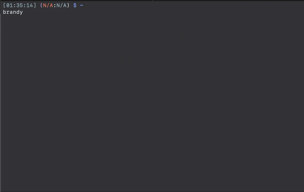

<div align="center">
  <strong>Show your AWS Profiles and set Environment you choose</strong>
</div>
<br />



## Install
```
$ brew tap 37108/homebrew-tap
$ brew install aws-brandy
```

## Configuration
I strongly reccomend to create an alias like this.  
This alias automatically set environment.

```
alias brandy='`aws-brandy`'
```

## Usage
```
$ brandy
```

## Contributing
See [CONTRIBUTE.md](CONTRIBUTE.md) for details.

## License
This library is distributed under the MIT license found in the [LICENSE](./LICENSE)
file.
